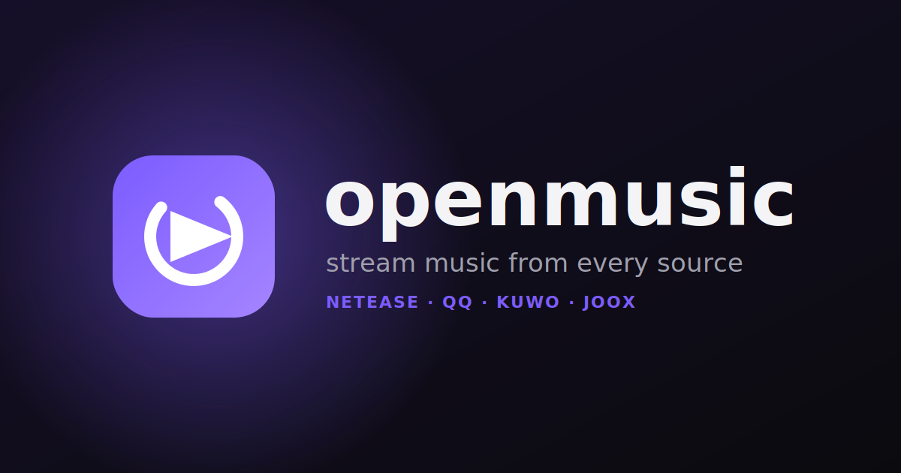

<p align="center">
  
</p>

# openmusic

A mobile-first web music player that searches and streams tracks aggregated from **NetEase, QQ, Kuwo and JOOX** through a same-origin proxy. Built with SvelteKit and deployed on Cloudflare Pages.

👉 **Live:** <https://openmusic.pages.dev>

> Ground-up rebuild of the data layer from [`CharlesPikachu/musicsquare`](https://github.com/CharlesPikachu/musicsquare) into a SvelteKit mobile app. The original single-file desktop player lives in the `upstream` remote / git history (it was the porting reference for the source adapters).

---

## Tech stack

- **Svelte 5** (runes) + **SvelteKit 2** + **Vite 8**, **TypeScript** (strict)
- **@sveltejs/adapter-cloudflare** — deploys as a Cloudflare Pages project (`openmusic`)
- **@lucide/svelte** icons · **Vitest** unit tests
- Package manager: **pnpm**

## Architecture

- **Metadata proxy** — a SvelteKit endpoint `src/routes/api/[source]/[...path]/+server.ts` fronts each source's **search / detail / lyrics** calls (CORS, bounded retry) and injects the JOOX token from `platform.env` so it never reaches the client bundle. **Audio streams browser → source CDN directly** (not through the proxy) to stay within Cloudflare's free-tier limits.
- **Source-adapter registry** — client adapters in `src/lib/sources/` + matching proxy adapters in `src/lib/proxy/`, enumerated once in a registry. Adding a source = a new client file + a new proxy file + one import; aggregation/dispatch names no source.
- **Presentation-layer services** (`src/lib/services/`) — `catalog` (allSettled fan-out + interleave), `dedupe` (cross-source de-dupe + best-quality pick), `picks` (diverse top-picks builder), `lrc` (LRC parsing), `share`, `translate`. The Phase-1 data layer (`sources/`, `proxy/`, `api/[source]`, `catalog`, `lrc`) is covered by **58 Vitest tests** and treated as stable.
- **Stores** (`src/lib/stores/`, Svelte 5 runes) — `player` (single app-wide `<audio>` + queue), `library` (liked / playlists / downloads), `settings`, `names` (display-name translation cache). All persist to `localStorage`, SSR-guarded.
- **Translation** — a separate `src/routes/api/translate/+server.ts` powers lyric translation and displayed-name translation.
- **Routing** — the `(app)` route group holds the mobile shell (home, search, library, settings, `/artist/[name]`, `/album/[name]`) with a persistent now-playing bar/overlay; the single `<audio>` lives in the root layout so playback survives navigation. `/spike` is a dev harness for the audio-egress test.

## Features

- Search across all sources, tap to play
- Full-screen now-playing: drag/expand, seekable progress, transport, draggable Up-Next / Lyrics / Related sub-nav
- Auto-advancing **and auto-growing** queue (never runs dry)
- Synced lyrics with smart auto-scroll (pauses on touch, resumes) + on-demand translation
- Translate displayed song/artist names (e.g. 简体 → 繁體)
- Diverse "top picks" from many artists, cached in `localStorage`, with a Randomize button
- Long-press any song → context menu: Play next, Add to queue, Download, Like, Add to playlist, Go to album/artist, Share, Detail
- Local library: liked songs, playlists, downloads
- Settings: lyric + name translation languages, default quality/source, accent color, reduce-motion, auto-expand
- Brand mark + favicon, web manifest, SEO meta + Open Graph / Twitter share card

## Getting started

```bash
pnpm install
pnpm dev          # dev server (Vite)
pnpm build        # production build (adapter-cloudflare → .svelte-kit/cloudflare)
pnpm preview      # serve the build locally via wrangler pages dev
pnpm check        # svelte-check (TypeScript, strict)
pnpm test         # run the Vitest suite (58 tests)
```

## Deployment

Pushes to **`main`** auto-deploy to **Cloudflare Pages** (project `openmusic`,
<https://openmusic.pages.dev>) via Cloudflare's **native Git integration** — no
GitHub Actions, no GitHub secrets, no manual `wrangler deploy`. The `/api/*` proxy
ships inside the same Pages build (`adapter-cloudflare` → `_worker.js`). Node 22 is
pinned via `.nvmrc` + `package.json` `engines.node`.

Production runtime secrets (`JOOX_TOKEN` **required**; `LASTFM_KEY` / `LASTFM_SECRET`
optional) must be set in the Pages dashboard, or `/api/*` breaks in production.

See **[docs/DEPLOY.md](docs/DEPLOY.md)** for the one-time dashboard setup, the exact
build settings, the full env-var reminder, and a manual `wrangler` fallback. Locally,
secrets go in a gitignored `.dev.vars` for `pnpm preview`.

## Project layout

```
src/
  app.html              # <head>: icons, manifest, theme-color
  app.css               # theme tokens (dark + violet)
  lib/
    sources/            # client source adapters + registry + Track type   (data layer)
    proxy/              # per-source proxy adapters + http helper           (data layer)
    services/           # catalog, dedupe, picks, lrc, share, translate
    stores/             # player, library, settings, names (runes)
    components/         # NowPlaying, TrackMenu, Logo
    actions/            # longpress
  routes/
    +layout.svelte      # root: global <audio>, SEO head
    (app)/              # mobile shell: home, search, library, settings, artist, album
    api/[source]/...    # music metadata proxy
    api/translate/      # lyric/name translation proxy
    spike/              # dev: browser-direct audio egress harness
static/                 # favicon.svg, icon-maskable.svg, og.svg, manifest.webmanifest, robots.txt, sitemap.xml
.planning/              # GSD planning docs (roadmap, phases, quick tasks)
```

## Scope & honesty notes

- Music is streamed from **unofficial third-party proxy APIs** (no SLA; they can change or rate-limit). This is a **demo / educational** project — copyrights belong to the original platforms.
- Audio is browser-direct; "Download" saves the file and references it in the library, but a web app can't replay an arbitrary saved file offline (the Downloads tab re-streams).
- Lyric/name translation uses an unofficial translation endpoint (best-effort, cached, falls back to originals).
- The product is being built with [GSD](https://github.com/glamboyosa/gsd); the formal roadmap (data-layer foundation → audio engine → library → UI shell → PWA service worker → iOS background audio → new sources/queue) lives in [`.planning/`](.planning/). Much of the live demo was built ahead of that sequence as `/gsd:quick` tasks.

## License

See [LICENSE](LICENSE). Upstream: [CharlesPikachu/musicsquare](https://github.com/CharlesPikachu/musicsquare).
